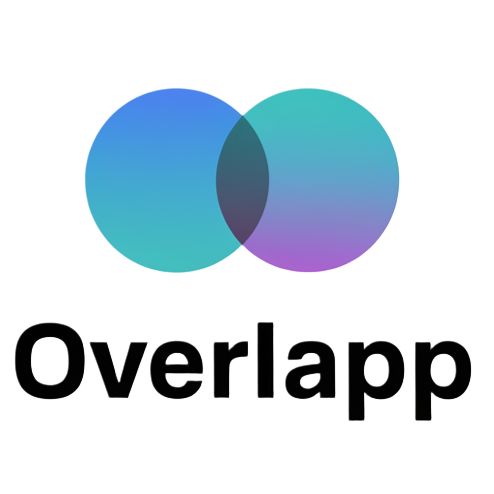

<p align="center">
  
</p>

# ✨ Overlapp - Where Digital Identity Meets Physical Reality

<div align="center">
  
  
  **Discover meaningful connections in both your digital and physical worlds.**
  
  [View Demo](https://overlapp.replit.app) | [Try MVP](#getting-started) | [Watch the Tour](https://youtube.com/overlapp)
</div>

## 📺 See Overlapp in Action

<div align="center">
  <table>
    <tr>
      <td align="center" width="50%">
        <a href="https://youtu.be/wa2ZeE_BhWY">
          
        </a>
        <p><em>Product Overview</em></p>
      </td>
      <td align="center" width="50%">
        <a href="https://youtu.be/J-ACL_Q2UXw">
          
        </a>
        <p><em>Feature Walkthrough</em></p>
      </td>
    </tr>
    <tr>
      <td align="center">
        <a href="https://youtu.be/yWqN2HUGDZw">
          
        </a>
        <p><em>Use Case Demo</em></p>
      </td>
      <td align="center">
        <a href="https://youtu.be/Rk7t0TWYNDg">
          
        </a>
        <p><em>Technical Architecture</em></p>
      </td>
    </tr>
  </table>
</div>

## 🚀 The Next Generation Social Discovery Platform

Overlapp isn't just another social app—it's a revolutionary platform that bridges your digital identity with your physical world. By analyzing the spaces where your interests intersect with others, Overlapp creates a truly unique social experience powered by cutting-edge AI technology.

### 💫 **Why Overlapp?**

- **Deeper Connections** — Move beyond superficial matching to find authentic shared interests
- **AI-Enhanced Discovery** — Let our GPT-4o powered system find connections you would never discover on your own
- **Digital + Physical Mapping** — See how your online interests manifest in real-world locations
- **Privacy-First Design** — Full transparency and control over your data

## 🌟 MVP Journey

### 1️⃣ **Express Yourself** *(60 seconds)*
<!-- Feature image placeholder -->

* **Select your avatar** and personalize your presence
* **Choose your interests** from our expansive selection of categories
* **Enhance with AI suggestions** that understand the nuances of your preferences
* **One tap to create** your digital identity layer

### 2️⃣ **Discover Your Connections** *(Instant Results)*
<!-- Feature image placeholder -->

* **Swipe through connection cards** showing people with shared interests
* **Explore interactive maps** of locations where your interests intersect with others
* **Get AI-powered analysis** of why each connection matters
* **Filter by relevance** to find your most meaningful matches

### 3️⃣ **Analyze Website Connections** *(New Feature)*
<!-- Feature image placeholder -->

* **Discover digital overlap** with others based on websites you both enjoy
* **Get personalized recommendations** for new sites that match your interests
* **See interest patterns** across your digital footprint

### 4️⃣ **Explore Store Matches** *(Exclusive Beta)*
<!-- Feature image placeholder -->

* **Find retail locations** that align with your interests and preferences
* **Connect with others** who frequent the same physical spaces
* **Receive AI-generated recommendations** for new stores to explore

## 🛠️ Technical Excellence

Overlapp leverages a modern tech stack for a blazing-fast, responsive experience:

* **React + TypeScript** for robust front-end development
* **AI-Powered Backend** with OpenAI's GPT-4o integration
* **Real-time Data Processing** with optimized algorithms
* **Elegant UI/UX** with Tailwind CSS + Shadcn components
* **Mobile-First Design** for seamless experiences on any device

<div align="center">
  <table>
    <tr>
      <td align="center" width="50%">
        <a href="https://www.youtube.com/watch?v=Rk7t0TWYNDg">
          
        </a>
        <p><em>👨‍💻 Technical Architecture</em></p>
      </td>
      <td align="center" width="50%">
        <a href="https://www.youtube.com/watch?v=wa2ZeE_BhWY">
          
        </a>
        <p><em>🎮 User Experience Design</em></p>
      </td>
    </tr>
  </table>
  <p><em>Watch our team explain Overlapp's innovative approach</em></p>
</div>

## 🔍 Core MVP Features

```markdown
├── Smart Profile Creation
│   ├── Intuitive interest selection
│   ├── AI-powered interest enrichment
│   └── Visual avatar customization
│
├── Connection Discovery
│   ├── Card-based connection interface
│   ├── Interactive location mapping
│   ├── AI-driven overlap analysis
│   └── Real-time filtering options
│
├── Digital Website Analysis
│   ├── Personalized website recommendations
│   ├── Connection matching through digital footprints
│   └── Interest pattern visualization
│
└── Store Discovery & Matching
    ├── Physical retail connection mapping
    ├── AI-curated store recommendations
    └── Interest-based store affinity scoring
```

## 👥 User Testimonials

<div align="center">
  <a href="https://www.youtube.com/watch?v=wa2ZeE_BhWY">
    
  </a>
  <p><em>💬 Watch real users share their Overlapp experiences</em></p>
</div>

> "Overlapp found connections I never would have discovered on my own. The AI recommendations are spot-on!" – Sarah K.

> "The combination of digital and physical mapping is genius. I've found amazing new places and people." – Mike T.

> "Finally, a social app that goes beyond superficial matching to create meaningful connections." – Jen D.

## 🚀 Getting Started

Experience Overlapp today:

```bash
# Clone the repository
git clone https://github.com/your-org/overlapp.git

# Install dependencies
npm install

# Launch the application
npm run dev
```

Then visit `http://localhost:5000` to start your journey!

## 🔮 The Future of Connection

Overlapp is just getting started. Our roadmap includes:

* **Enhanced AI personalization** for even more relevant matches
* **Expanded location intelligence** with real-time updates
* **Community features** to deepen connections with like-minded people
* **Mobile app** with advanced geolocation capabilities

---

<div align="center">
  <p><b>Overlapp</b> — Where your digital and physical worlds converge.</p>
  <p>© 2025 Overlapp, Inc. • <a href="https://twitter.com/overlapp">Twitter</a> • <a href="https://instagram.com/overlapp">Instagram</a></p>
</div>