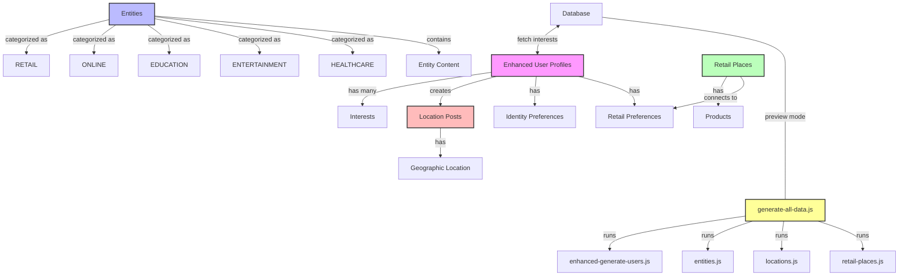

# Synthetic Data Relationships

## Data Type Attributes

### Enhanced User Profile
- Username
- Display Name
- Avatar
- Bio
- Age
- Occupation
- Location
- Gender
- Country of Origin
- Languages Spoken
- Cultural Background
- Education
- Professional Field
- Collaboration Style
- Personal Values
- Digital Identity
- Physical Activity Level
- Cultural Experiences
- Learning Style
- Identity Preferences
  - Attribute Importance

### Entity
- Name
- Category
- Description
- Icon URL
- Website URL
- Is AI Generated
- Content Items
  - Title
  - Description
  - URL
  - Thumbnail URL
  - Content Type

### Location Post
- User ID
- Content
- Location
  - Place Name
  - Latitude
  - Longitude
  - Location Type

### Retail Place
- Name
- Category
- Description
- Type (PHYSICAL/ONLINE)
- Products
- Location (if PHYSICAL)
- Website URL (if ONLINE)

## Generated Files

1. **enhanced-synthetic-users.json** - Contains all generated user profiles
2. **create-enhanced-users.js** - Script to import users to database
3. **retail-data.json** - Contains all retail places and products
4. **synthetic-entities.json** - Contains all digital and physical entities